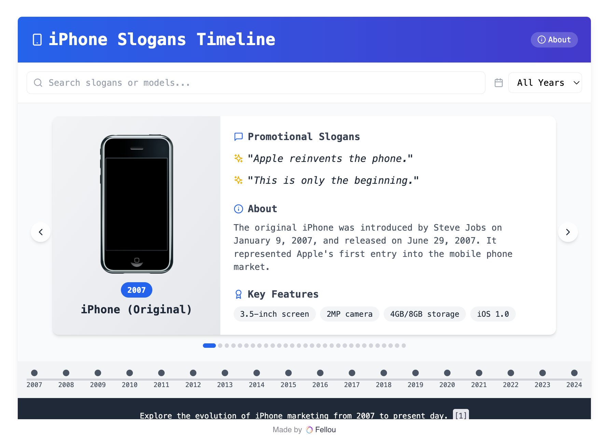
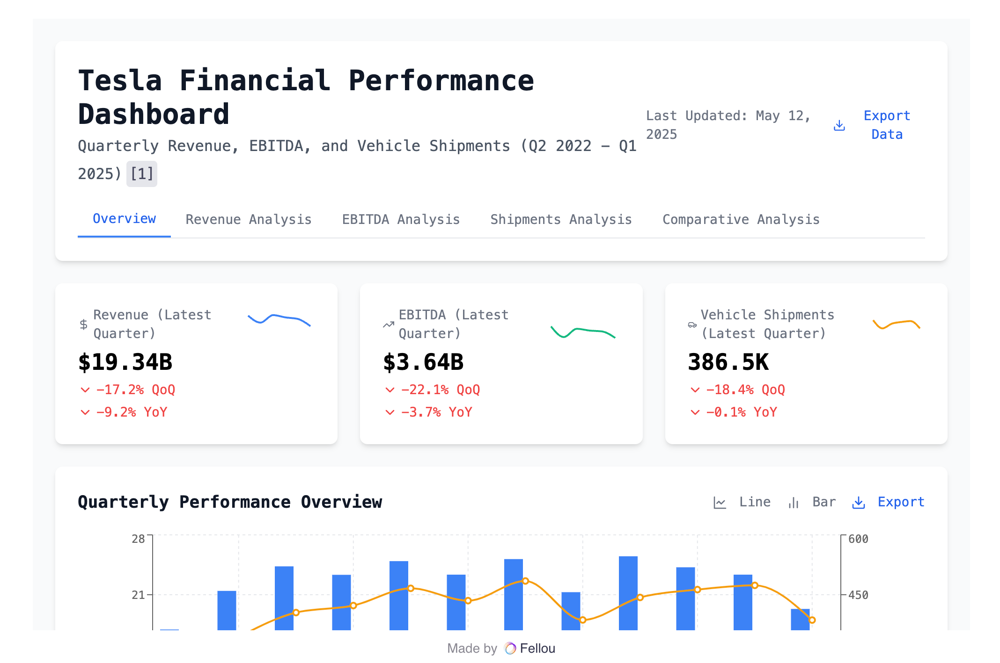
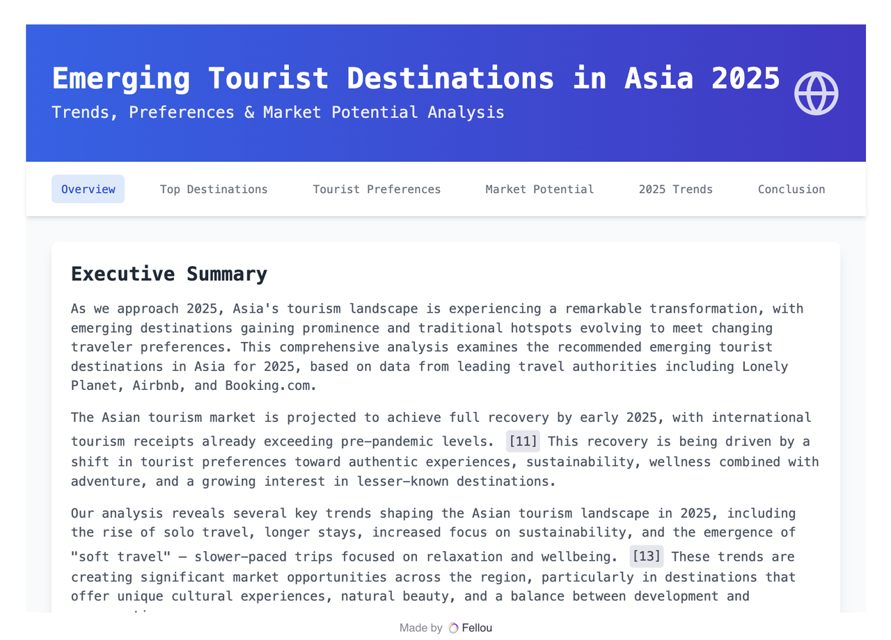
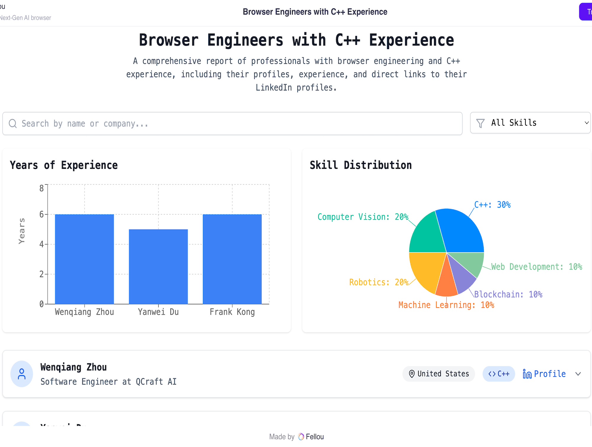

# Fellou（Agentic 浏览器）

## 简介
Fellou 是全球首个 Agentic 浏览器，致力于让 AI 代理成为每个人、每台设备上的数字伙伴。它不仅能智能浏览，还能自动执行复杂任务、生成报告、跨应用集成，极大提升生产力和自动化水平。支持多平台、隐私保护，适合需要高效信息处理和自动化办公的用户。

## 核心特性
- 智能浏览与自动执行任务
- 跨应用集成与自动化工作流
- 多平台支持，隐私保护

## 典型 Use Case
- 
  **[Find iPhone Slogans](https://chat.fellou.ai/report/share/iphone-slogans-timeline-2sOyql6B)**
  > 帮我查找历年来 iPhone 的宣传标语。
- 
  **[Tesla Revenue, EBITDA & Shipments](https://chat.fellou.ai/report/cd489dfe-b6ca-4447-9b35-5e8e88df11a8)**
  > 获取特斯拉近 12 个季度的营收、EBITDA 和出货量。
- 
  **Product Hunt to Notion**
  > 将 Product Hunt 排名前 8 的产品名称和简介添加到已打开的 Notion 页面。
- 
  **[Unique Gift Finds](https://chat.fellou.ai/report/share/personalized-gift-guide-OAJrwZrm)**
  > 从创意平台和小众市场发现独特且个性化的礼物创意。
- 
  **[Silicon Valley AI Tracker](https://chat.fellou.ai/report/share/ai-investment-dashboard-eG5-BPVp)**
  > 聚合硅谷 20 家顶级 VC 网站的 AI 趋势，包括投资、观点和进展，并附原始链接。
- 
  **[Find C++ Engineers](https://chat.fellou.ai/report/2e21f461-68ef-4e6a-abd1-37511319f841)**
  > 在 LinkedIn 上搜索有 C++ 经验的浏览器工程师，提供简介和个人主页链接。
- 
  **Book meeting on Calendar**
  > 打开 Google 日历，安排一场 AI 技术分享会。
- 
  **[Burn Fat at Home](https://chat.fellou.ai/report/share/beginner-home-workout-guide-BQMVlIER)**
  > 有哪些适合初学者的居家燃脂训练？每周应训练几次？
- 
  **Post article on LinkedIn**
  > 打开 LinkedIn，撰写并发布一篇关于 DeepSeek 的观点文章。
- 
  **[AI PM Trends](https://chat.fellou.ai/report/share/ai-product-manager-job-analysis-9Y5zKcI1)**
  > 分析 LinkedIn 上 AI 产品经理岗位的 JD，关注技能、经验和招聘趋势。
- 
  **[Headphone Feedback Analysis](https://chat.fellou.ai/report/share/headphone-feedback-analysis-v2QhwCJi)**
  > 分析近 30 天 Twitter/Reddit 上耳机相关反馈，汇总用户关注点并给出产品/市场建议。
- 
  **Send Google email**
  > 发送一封友好的邮件，邀请团队明天上午 9 点开会。

## 效果评估
- 用户反馈积极，提升了信息处理和自动化办公效率。
- 相关评测数据可参考官网或社区。

## 安装与使用
- 访问官网下载安装：[https://fellou.ai/](https://fellou.ai/)

## 相关链接
- [官网](https://fellou.ai/)
- [官方文档](https://fellou.ai/)
- [社区讨论](https://twitter.com/fellouai) 