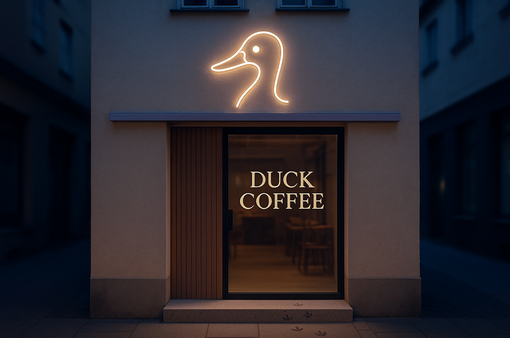
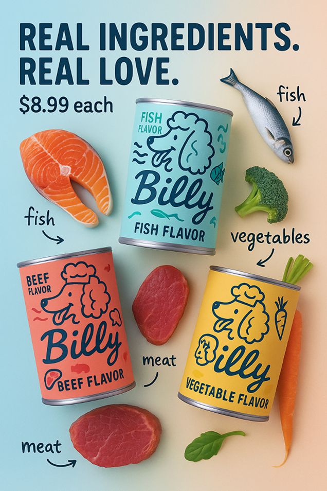
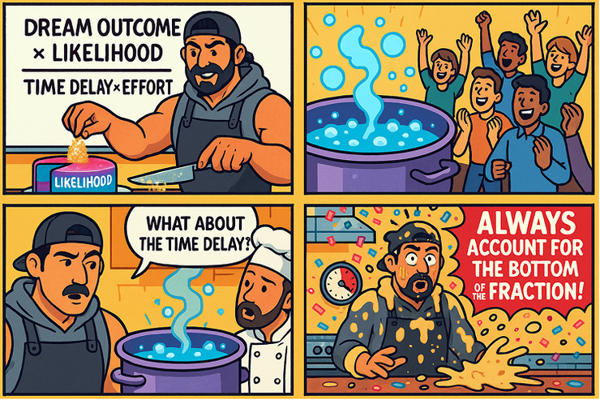

# Lovart（AI 设计 Agent）

## 简介
Lovart 是一款新一代 AI 设计 Agent，致力于将人类创意与 AI 智能深度融合，支持自动化创意生成、协同设计与多场景落地，适用于品牌、包装、艺术、营销等多元设计需求。

## 核心特性
- 人机协同创作：支持 AI 与设计师同屏协作，提升创意效率
- 多场景设计：涵盖品牌、包装、艺术、营销等多种设计场景
- 一键多稿：单次输入即可生成多种风格与尺寸的设计稿
- 智能编辑与微调：AI 辅助下的细节调整与高效迭代
- API 集成：支持与主流设计/生产工具集成，便于工作流自动化

## 典型 Use Case
- 
  **先锋包袋设计**
  > Lovart 结合前卫造型与高定美学，自动生成独特包袋设计方案。
  [查看案例](https://www.lovart.ai/r/pgmbiz7)
- 
  **咖啡品牌包装**
  > 为 Duck Coffee 打造环保且极具视觉冲击力的包装设计。
  [查看案例](https://www.lovart.ai/r/f2qi0ri)
- 
  **像素派对海报**
  > 利用像素风格与高级排版，生成游戏主题创意海报。
  [查看案例](https://www.lovart.ai/r/1myj89s)
- 
  **宠物品牌手绘 LOGO**
  > 将宠物形象转化为品牌手绘 LOGO，兼具趣味与辨识度。
  [查看案例](https://www.lovart.ai/r/dursp5z)
- 
  **艺术海报创作**
  > 利用强烈色彩与超现实质感，生成极具张力的艺术海报。
  [查看案例](https://www.lovart.ai/r/8gcgadq)
- 
  **营销 Meme 四格漫画**
  > 自动生成创意四格漫画，助力品牌营销内容出圈。
  [查看案例](https://www.lovart.ai/r/vjicewk)
- 
  **AI 设计实时演示**
  > 展示 Lovart 自动化设计流程与人机协同创作体验。

## 效果评估
- 支持多行业、多场景的高效创意生产，显著提升设计产能与灵感落地速度。
- 用户反馈 Lovart 极大降低了设计门槛，适合个人与团队协作。

## 安装与使用
- 访问官网体验：[https://www.lovart.ai/](https://www.lovart.ai/)
- 当前为 Beta 版本，可加入候补名单获取体验资格。

## 相关链接
- [官网](https://www.lovart.ai/)
- [关于我们](https://www.lovart.ai/statement/about-us)
- [使用条款](https://www.lovart.ai/statement/terms-of-use)
- [隐私政策](https://www.lovart.ai/statement/privacy-policy)
- 联系邮箱：support@lovart.ai 